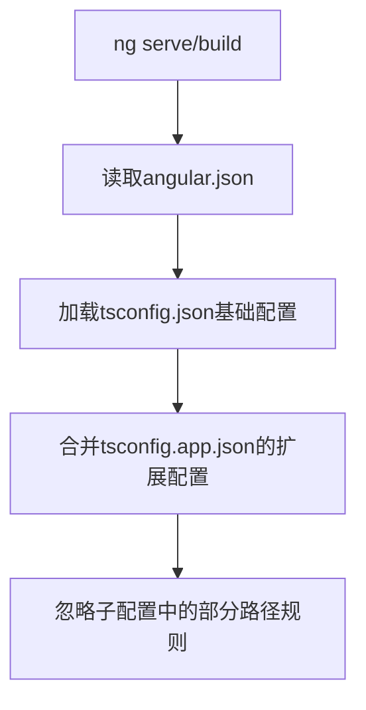

## 🧰 核心价值

- 解决什么问题：技术面试高频考点速查
- 适用场景：面试前 1 周冲刺复习
- 复用案例：已助力 [[2025Q1-求职前端岗位]]

## 📂 内容结构

### 前端基础

### 框架相关

- Angular：
	- [[ng serve 的执行步骤]]

### 浏览器原理

 - 经典题：[[从输入URL到页面展示全过程]]
 - 变体题：[[跨站脚本攻击防御方案]]

### 性能优化

- [ ] [[为什么使用SSR（服务端渲染）？]]

## 🔄 更新日志

| 日期         | 变更内容    | 贡献者   |
| ---------- | ------- | ----- |
| 2025-06-15 | 新增优先级字段 | 系统管理员 |
| 2025-04-01 | 初始版本发布  | 知识管理组 |

## React

### React 基础

- 避免重复渲染：
	- Q：为什么不能使用这样的写法：`<button onClick={handleClick()}>，handleClick会调用setState`
	- A：因为 JavaScript 会立即求值表达式 `handleClick()` ，将其结果作为 onClick 的回调函数。这会导致重新渲染组件，而渲染组件后又会再次渲染组件从而导致无限循环。

## Angular

- ng serve 的执行顺序

