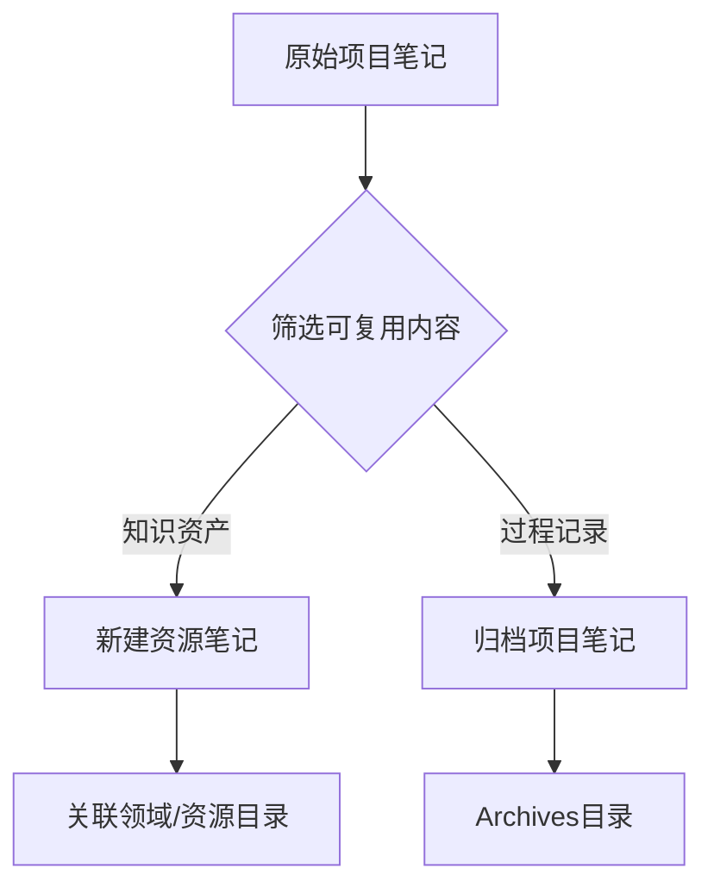

## 🧰 核心价值

- 解决什么问题：PARA 笔记转化
- 适用场景：将项目笔记中的可复用知识提炼
- 项目案例： [[2025Q1-使用PARA笔记法重构PKM]]
- 关联文章：[[PARA实施常见问题集]]

## 📂 内容结构

### 一、转化流程



### 二、转化步骤（以 [[2025Q1-求职前端岗位]] 为例）

1. 识别知识资产
	- 在项目笔记中标记以下内容：

```markdown
## 📦 核心产出（标记候选资源）
- [[前端面试题库]] 💎
- [[薪资谈判话术]] 💎
- [[投递记录模板]] 💎
```

2. 创建资源框架
	- 使用 [[PARA通用笔记模板#资源笔记模板（知识资产的陈列馆）]] 新建资源
	- 将标记的知识资产加入资源

2. 资源目录整合
	- 在 RESOURCES

### 三、关键验证清单

执行转化后检查以下要素：

1. 资源独立性

	- ✅ 不包含项目特有的时间/人物信息
	- ✅ 所有案例可脱离原项目上下文理解

2. 可检索性
		- ✅ 至少包含 2 个分类标签（如 `#前端开发`）
		- ✅ 在 3 个以上地方被引用（领域/其他资源/项目）

3. 可维护性

	- ✅ 标注明确的更新频率（如 " 每月合并新题 "）
	- ✅ 设置价值衰减预警（如：`rating: ★★★★☆`）

## 🔄 更新日志

- 2025/03/06 完成工作流 v1.0
