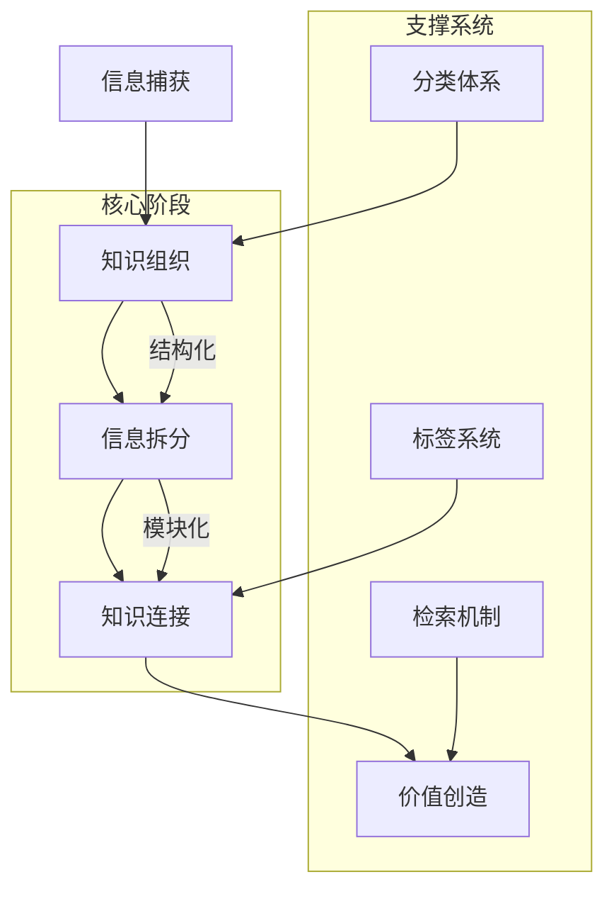

## 知识管理工作流

### 信息收集（略读/订阅）

- 概念：通过高质量 [[信息源]] 来收集优质信息
- 工具：
	- 简悦：浏览器插件，阅读模式、稍后读、本地导出
	- [[RSS]]：RSSHub Radar + Follow/Inoreader/Tidyread/Readwise
- 我的方案：
	- 简悦 + RSS 方案，实现本地和云端的双向同步，因为本地化，所以可以非常快

### 信息管理（存储）

- 概念：将知识以一定方式组织起来，关注的知识的管理成本和检索成本，一般而言，管理成本和检索成本成反比
- 方法：
	- [[PARA笔记组织法]]
	- [[卢曼卡片盒笔记法]]
- 工具：
	- Obsidian
- 我的方案：
	- [[PARA笔记组织法]]

### 信息拆分（拆分/提炼）

- 概念：将信息拆分提炼，转化为更小粒度的利于吸收的知识
- 方法：
	- [[信息拆分]]
- 工具：
	- Tidyread：AI 解构 + 提炼，不能做笔记
	- 简悦稍后读：高亮 + 笔记，可以做笔记，体验一般
	- Follow：开源 RSS 阅读器，不能做笔记
- 我的方案：
