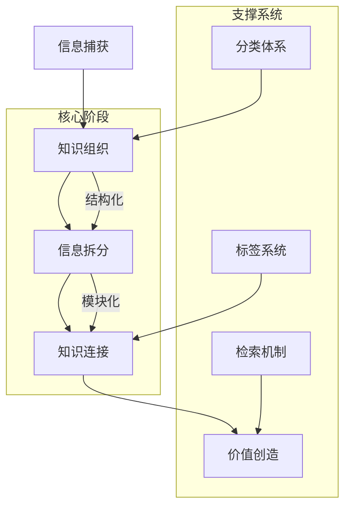

> [!hint]
> 社区推荐：[PKMer社区](https://pkmer.cn/page/)
> 博主推荐：[Zsolts](https://www.youtube.com/@VisualPKM)

设计哲学：==真正的知识管理不是整理过去，而是设计未来==

## 概述

" 知识管理 " 一词最早起源于工商管理领域，其目的是应用管理学知识使得企业更加高效的运转。 个人知识管理，其核心在于统筹自己的知识，让我们对自己的知识有更深更全的把握，让我们能够更加系统性的分析自己的能力构成，实现知识复利效应。

## 一、知识管理的原则

1. 滚动原则
	- 知识必须在使用中产生价值，避免成为信息坟墓
	- 典型反例：收藏上百篇未分类的微信文章
2. 情境原则
	- 知识有效性高度依赖使用场景
	- 示例：同一份市场报告可复用在销售策略指定和技术路线规划中
3. 演化原则
	- 知识需要迭代更新，形成版本生命周期
	- 健康指标：季度性更新率 > 30%
4. 网络原则
	- 知识价值随链接节点数正比例增长
	- 价值指标：`知识价值 = 节点数 * 连接强度`

## 二、知识管理工作流

参见：[[知识管理工作流]]

## 三、知识管理的方法

- 参见：[[知识组织概述]]

## 参考文章

- [PKMer_Echo 的卡片盒笔记法工作流程及 Obsidian 实践](https://pkmer.cn/Pkmer-Docs/02-%E7%9F%A5%E8%AF%86%E7%AE%A1%E7%90%86%E5%9F%BA%E7%A1%80/%E7%9F%A5%E8%AF%86%E7%AE%A1%E7%90%86%E5%9C%86%E6%A1%8C%E8%AE%A8%E8%AE%BA/echo/echo%E7%9A%84%E5%8D%A1%E7%89%87%E7%9B%92%E7%AC%94%E8%AE%B0%E6%B3%95%E5%B7%A5%E4%BD%9C%E6%B5%81%E7%A8%8B%E5%8F%8Aobsidian%E5%AE%9E%E8%B7%B5/)
- [PKMer_个人知识管理 - 简化生活的终极指南](https://pkmer.cn/Pkmer-Docs/02-%E7%9F%A5%E8%AF%86%E7%AE%A1%E7%90%86%E5%9F%BA%E7%A1%80/para%E4%BF%A1%E6%81%AF%E7%BB%84%E7%BB%87%E6%B3%95/%E4%B8%AA%E4%BA%BA%E7%9F%A5%E8%AF%86%E7%AE%A1%E7%90%86-%E7%AE%80%E5%8C%96%E7%94%9F%E6%B4%BB%E7%9A%84%E7%BB%88%E6%9E%81%E6%8C%87%E5%8D%97/)
- [PKMer_myZettelkasten 介绍](https://pkmer.cn/Pkmer-Docs/02-%E7%9F%A5%E8%AF%86%E7%AE%A1%E7%90%86%E5%9F%BA%E7%A1%80/%E7%9F%A5%E8%AF%86%E7%AE%A1%E7%90%86%E5%9C%86%E6%A1%8C%E8%AE%A8%E8%AE%BA/terry/myzettelkasten-%E4%BB%8B%E7%BB%8D/)
- [如何用 AI 重塑我们的信息获取流程？ - 少数派 (sspai.com)](https://sspai.com/post/90423)
